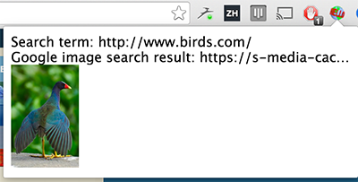

Gopherjs Chrome Bindings
------------------------------------

[](https://godoc.org/github.com/fabioberger/chrome)

Write Chrome extensions in Go!

With the help of the [Gopherjs transpiler](https://github.com/gopherjs/gopherjs), you can now write Go code which will be converted into javascript and run in the browser. This library contains the necessary bindings to interact with the Chrome Javascript API in an easy and intuitive way so that you can write Chrome Extensions and Chrome OS apps in Go.

# Installation

First make sure you have Gopherjs installed:

```bash
go get -u github.com/gopherjs/gopherjs
```

Next, install the chrome bindings library:

```bash
go get github.com/fabioberger/chrome
```

and include the package in your project's imports:

```bash
import "github.com/fabioberger/chrome"
```

# Sample Extension

The lovely people at Google's Chrome team have written a [great post](https://developer.chrome.com/extensions/getstarted) on how to get started building chrome extensions. Within the examples folder you will find a [Go version](https://github.com/fabioberger/chrome/tree/master/examples/getting-started-sample) of the JS sample extension they cover in their post.



In order to run this sample extension, simply navigate to ```chrome://extensions``` from within your chrome browser and click ```Load unpacked extension...``` and open the examples/getting-started-sample folder. This should install the chrome extension. Now visit any webpage and click on the globe-like icon on the top right of your chrome browser.

# Creating a New Extension

Here is a step-by-step guide on how to create a chrome extension written in go. First, lets create a new project folder and create a manifest.json and popup.html file within it:

```
mkdir my_chrome_extension
```

```
cd ./my_chrome_extension
```

```
touch manifest.json
```

```
touch popup.html
```

Lets write the following into our manifest:

```json
{
  "manifest_version": 2,

  "name": "My Chrome Extension",
  "description": "This is a chrome extension written in Go",
  "version": "1.0",

  "browser_action": {
    "default_popup": "popup.html"
  },
  "permissions": [
    "tabs"
  ]
}
```

The most important aspects of the manifest file are the permissions included. In order to use a particular Chrome API, you will need to include its permission-type within this manifest file. Since this demo extension will create new tabs every time we active it, we have included the "tabs" permission.

Lets also add the following to the popup.html file:

```html
<html>
  <head>
  <style>
      #notification {
        width: 300px;
      }
    </style>
  </head>
  <body>
  	<h1 id="notification"></h1>
  	<script src="app.js"></script>
  </body>
</html>
```
Here we simply declare an h1 tag with an id we can reference from within our app. We also include an "app.js" script which will eventually contain the JS version of our Go code.

The next step is to create our app.go file, we will do this within a go folder which will contain all our Go code:

```
mkdir go
```

```
cd go
```

```
touch app.go
```

Within this app.go file, we will write the following:

```go
package main

import (
	"strconv"
	"honnef.co/go/js/dom"
	"github.com/fabioberger/chrome"
)

func main() {
	c := chrome.NewChrome()

	tabDetails := chrome.Object{
		"active": false,
	}
	c.Tabs.Create(tabDetails, func(tab chrome.Tab) {
		notification := "Tab with id: " + strconv.Itoa(tab.Id) + " created!"
		dom.GetWindow().Document().GetElementByID("notification").SetInnerHTML(notification)
	})

}
```
This program imports Dominikh's [dom](https://github.com/dominikh/go-js-dom) package for easy dom manipulation and the chrome bindings. We first instantiate the chrome object with "chrome.NewChrome()" and call methods on its properties, in this case "Tabs.Create".

Whereas in javascript you would write:

```js
chrome.tabs.create(tabDetails, function(tab) {
	console.log(tab)
})
```

in Go, you can now write:

```go
c.Tabs.Create(tabDetails, func(tab chrome.Tab) {
	fmt.Println(tab)
})
```

The rest of the script calls Create() on the Tab property, creating a new non-active tab. Once the tab has been created, the callback function is called and the newly created Tab struct is returned. We then simply append a nice message to the notification header included in the popup.html  file.

The last step is for us to transpile our app.go code into an app.js file:

```
gopherjs build app.go -o ./../app.js
```

This will create an app.js file within our main project folder that will be included into the popup.html page upon load. And we are done!

In order to run your newly created chrome extension, upload the containing folder from the "chrome://extensions" page by clicking "Load unpacked extension...". Then click on the puzzle piece icon in the top right of your chrome browser. Et Voila!

# Tests

Because of the immense amount of endpoints in the Chrome API, as well as the many different requirements for the endpoints, the tests are still a work in progress.

To run the tests, install the ```tests``` folder as a chrome extension by navigating to ```chrome://extensions``` in Chrome and clicking ```Load unpacked extension...``` and navigating to the "tests" folder. Once you have done time, simply click the ```T``` icon on the top right of your chrome browser and the test suite will run within the displayed popup.

Feel free to add more tests to this extension and submit a pull request!
